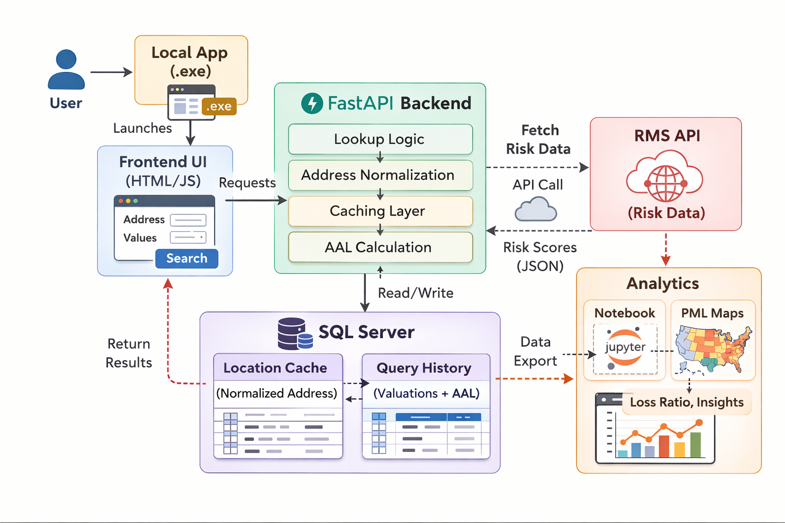

# RMS Wildfire Risk Analytics Platform

## Architecture

## Overview
This project is an end-to-end wildfire risk analytics platform that integrates Moody’s RMS API into an underwriting workflow.

It allows users to query property-level wildfire risk, automatically cache results into a SQL database, and generate analytics such as Average Annual Loss (AAL) and PML-based insights.

---

## Business Problem
Manual wildfire risk lookup is time-consuming and repetitive in underwriting workflows. Repeated API calls also create inefficiencies and unnecessary cost.

This project was built to:
- automate wildfire risk lookup
- reduce redundant API calls
- store reusable risk data
- support underwriting and pricing analysis

---

## Key Features

### Real-Time Risk Lookup App
- FastAPI backend with built-in frontend UI
- Accepts address and exposure inputs
- Returns:
  - wildfire risk scores (100 / 250 / 500 year)
  - annual loss rates (ALR)
  - average annual loss (AAL)

### RMS API Integration
- Uses Moody’s RMS Composite API
- Combines geocode, wildfire risk score, and loss cost layers
- Parses structured risk and loss outputs

### SQL Caching System
- Normalizes address to avoid duplicates
- Checks database before calling API
- Stores:
  - location-level risk metrics
  - full API response JSON

### Query History Tracking
- Stores valuation-based scenarios separately
- Enables comparison across different exposure assumptions

### Batch Processing Pipeline
- Processes large portfolios via Excel input
- Automates API calls and result generation

### Risk Analytics
- PML mapping and spatial risk visualization
- Loss ratio and exposure analysis

---

## Architecture

Frontend UI  
↓  
FastAPI Backend  
↓  
Moody’s RMS API  
↓  
SQL Server (Cache + Query History)  
↓  
Analytics / Mapping  

---

## Repository Structure

rms-wildfire-risk-app/
├── app/
│   └── main.py
├── scripts/
│   ├── rms_batch_runner.py
│   └── excel_to_sql_loader.py
├── notebooks/
│   └── gross_pml_map.ipynb
├── tests/
│   └── initial_test.py
├── requirements.txt
├── .env.example
└── README.md

---

## Tech Stack
- Python
- FastAPI
- SQL Server (pyodbc)
- Pandas
- Moody’s RMS API
- Jupyter Notebook

---

## Setup

Install dependencies:
pip install -r requirements.txt

Create `.env` file:
RMS_API_KEY=your_api_key
RMS_HOST=https://api-use1.rms.com
MSSQL_SERVER=your_server
MSSQL_DATABASE=your_database

Run the app:
uvicorn app.main:app --reload

---

## Business Impact
- Reduced manual risk lookup time
- Eliminated redundant API calls through caching
- Improved underwriting efficiency
- Enabled property-level risk analytics

---

## Future Improvements
- Cloud deployment
- Add authentication
- Portfolio-level risk dashboard
